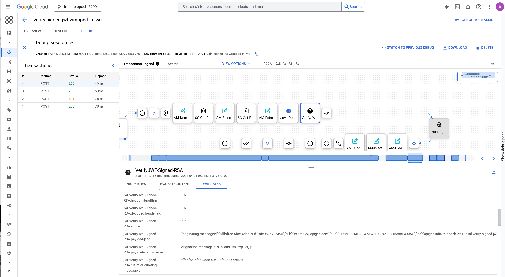

# Verify a signed JWT that has been wrapped in a JWE

This is a sample API Proxy for Apigee.
It illustrates how you can configure Apigee to:

- accept an inbound [JWE](https://datatracker.ietf.org/doc/html/rfc7516) encrypted with RSA-OAEP-256
- decrypt the JWE to recover a *signed JWT* payload (described in [IETF RFC 7519](https://datatracker.ietf.org/doc/html/rfc7519))
- verify the signature on the signed JWT

The fields in the inner JWT are then available for further examination, or
for using within Conditional flows in the Apigee proxy.

It works with Apigee X, as of Friday,  4 April 2025.

You could use this proxy as an example of a sequence you might want to include
in your own proxies, if you need to process signed JWT that have been wrapped in
a JWE.

## More Details

This is a loopback proxy, meaning that it does not connect to any target or
upstream system.  The purpose of the API proxy is only to illustrate how you
would perform the 2-stage process of decrypting a JWE payload, then verifying
the signature on the cleartext that you recover from the decryption step.

- The example uses the custom policy for JWE available
  [here](https://github.com/DinoChiesa/Apigee-CustomPolicy-EncryptedJWT)

- It relies on the builtin
  [VerifyJWT](https://cloud.google.com/apigee/docs/api-platform/reference/policies/verify-jwt-policy)
  policy for verifying the signed JWT

- The example has been tested only on Apigee X.  It will also work on hybrid,
  though I have not tried it.  I don't know if it will run on Apigee Edge. If
  you are using Edge in 2025, you should upgrade.

## About Keys

The reason you would do this is to benefit from the secrecy or privacy that is
afforded by an encrypted payload (the JLWE), while also allowing the decrypter
to be assured that the JWT has been signed by a trusted party.

These guarantees work only if you manage your keys correctly. The key used to
sign the inner JWT should be a private key known only by the signer.  The key
used to encrypt the JWE should be a public key, which matches only a key held by
the decrypter.

## License

This code is Copyright © 2025 Google LLC, and is released under the
Apache Source License v2.0. For information see the [LICENSE](LICENSE) file.

## Disclaimer

This example is not an official Google product, nor is it part of an official Google product.

## Screencast

You can view a [screencast walkthrough of this
example](https://youtu.be/MxvjI2COwMs) on Youtube:

## Support

This sample is open-source software, and is not a supported part of Apigee.  If
you need assistance, you can try inquiring on [the Google Cloud Community forum
dedicated to Apigee](https://goo.gle/apigee-community) There is no service-level
guarantee for responses to inquiries posted to that site.
